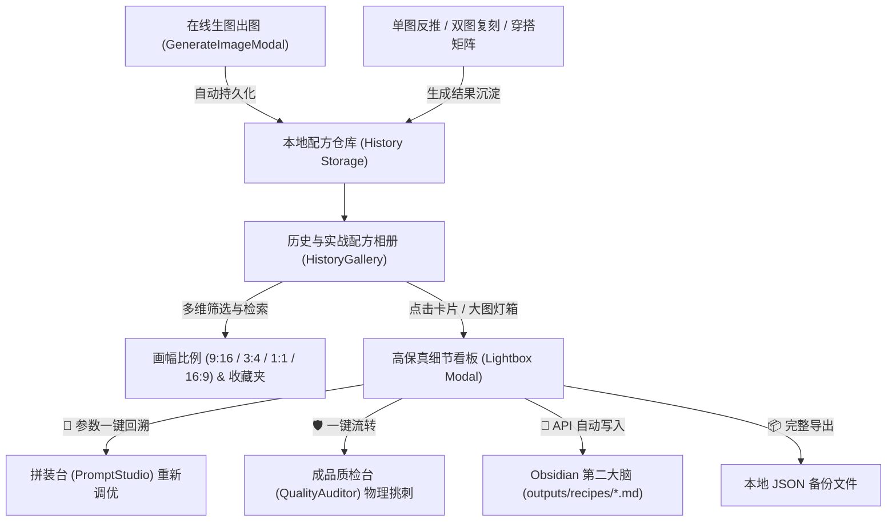

# 生图历史与配方相册工作流

> 💡 本工作流是 **AI 生图全链路闭环（Phase 5）** 的最后核心基石。它解决了“生图结果零散丢失、优秀提示词无法精准还原、跨环节参数断层、实验资产无法长期沉淀为第二大脑”的行业痛点。

---

## 1. 核心目标与定位

在日常生图流程中，生成一张满意的图像往往经历多次微调。如果缺乏结构化的配方归档机制，创作者常常面临以下困境：
1. **灵感遗失**：生成出一张绝美构图或光影神图后，由于窗口关闭或缺乏记录，再也无法找回当时精确的参数。
2. **断层断代**：生成图若存在局部肢体或阴影微瑕，无法一键流转到挑刺质检台进行重绘修复。
3. **第二大脑割裂**：前端生成的配方无法自动化同步落盘至 Obsidian 笔记库，形成持久复利的知识代码库。

本工作流通过 **本地持久化存储（Local Storage）** + **Dribbble 级视觉相册** + **多维快速流转（回溯拼装台 / 送入质检 / 导出 JSON / 知识库一键同步）**，打通生图全周期的最后闭环。

---

## 2. 核心架构与数据流转



---

## 3. 配方数据模型标准 (Schema)

每条历史记录严格遵循统一的 JSON 结构，记录模特母版（赵凤丽 168cm/65kg）、画幅、耗时与模块化穿搭蓝图：

```typescript
export interface HistoryRecord {
  id: string;                 // 唯一自增/UUID
  imageUrl: string;           // 产出图片 URL 或 Base64
  prompt: string;             // 完整生图提示词
  model: string;              // 生图模型 (Flux-Schnell / DALL-E-3 / Midjourney)
  aspectRatio: string;        // 比例 (9:16, 3:4, 1:1, 16:9)
  durationSeconds: number;    // 生图响应耗时 (秒)
  timestamp: number;          // 时间戳
  createdAt: string;          // 格式化日期时间
  characterName: string;      // 模特身份 (如: 赵凤丽)
  starred?: boolean;          // 精选收藏状态
  tags: string[];             // 检索标签
  category: string;           // 来源分类 (在线生成 / 穿搭矩阵 / 单图反推)
  studioPreset?: {            // 拼装台还原蓝图
    upper: string;            // 上装
    lower: string;            // 下装
    hosiery: string;          // 丝袜与腿部
    shoes: string;            // 鞋履及接触阴影
    scene: string;            // 场景环境
  };
}
```

---

## 4. 四大核心操作流

### 4.1 自动捕获与静默沉淀
- 在任何生图弹窗（`GenerateImageModal`）触发生成后，一旦服务端成功返回 `imageUrl`，系统自动包装完整配方对象，调用 `saveHistoryRecord()` 静默持久化。
- 自动写入首选标签（如比例、模型名称、分类）。
- 容量保护策略：自动维护最近 100 条高质量记录，防止超出浏览器 LocalStorage 配额。

### 4.2 毫秒级多维检索与精选收藏
- **画幅筛选**：一键切换 9:16（手机镜自拍）、3:4（经典写真）、1:1（细节特写）、16:9（电影级横画幅）。
- **心标收藏**：对满意的“神图”打星标（Star），在“已收藏”看板中快速提炼代表作。
- **全局全文检索**：支持对提示词中的服装材质（如“羊毛”、“20D微透”）、场景（“咖啡厅”、“电梯”）、模型引擎进行实时模糊搜索。

### 4.3 闭环无缝回溯 (Cross-Module Roundtrip)
- **回溯至拼装台 (`onLoadToStudio`)**：若记录包含 `studioPreset`，一键将上装、下装、丝袜、鞋履、场景解包并回填至拼装台输入框，允许基于原神图微调。
- **送入成品质检台 (`onSendToAudit`)**：一键将生成的原图和 Prompt 送入成品质检挑刺台，执行 6 维物理光学与模特 DNA 体检，定位 AI 伪影后一键生成重绘修复指令。

### 4.4 第二大脑归档与版本化 (Obsidian Sync)
- 点击卡片或大图灯箱上的 **“同步 Obsidian”** 按钮。
- 前端异步请求 `/api/sync-obsidian`。
- 服务端将完整模特基线、穿搭拆解、物理法则开关与中英双语 Prompt 编译为标准 Frontmatter Markdown 文件，写入知识库 `outputs/recipes/YYYY-MM-DD - 配方名.md`。
- 自动更新主入口 [[index.md]] 的交付物清单，并向 [[log.md]] 追加操作审计日志。

---

## 5. 验收与质量检查标准

| 检查项 | 验收标准 | 验证结果 |
| :--- | :--- | :--- |
| **实时保存** | 在线生图成功后，无需人工干预立即入库相册 | ✅ 已实现 (GenerateImageModal 自动触发) |
| **画幅与收藏筛选** | 切换 9:16 / 3:4 / 1:1 / 16:9 及收藏夹毫秒级响应 | ✅ 已实现 |
| **大图灯箱 (Lightbox)** | 支持高保真预览、完整 Prompt 滚动查看、一键复制 | ✅ 已实现 |
| **拼装台回溯** | 点击“回溯”精准恢复上装、下装、丝袜、鞋履及场景参数 | ✅ 已实现 |
| **成品质检流转** | 点击“质检”精准将图像与 Prompt 注入质检台进行雷达扫描 | ✅ 已实现 |
| **安全存储与备份** | 支持一键导出所有配方为 JSON 离线文件 | ✅ 已实现 |
| **Obsidian 自动化同步** | 遵循 AGENTS.md 规范落盘，并在 index/log 建立索引 | ✅ 已实现 |

---

*归档自 PromptStudio AI 闭环体系 · Phase 5 生图历史与实战配方相册*
